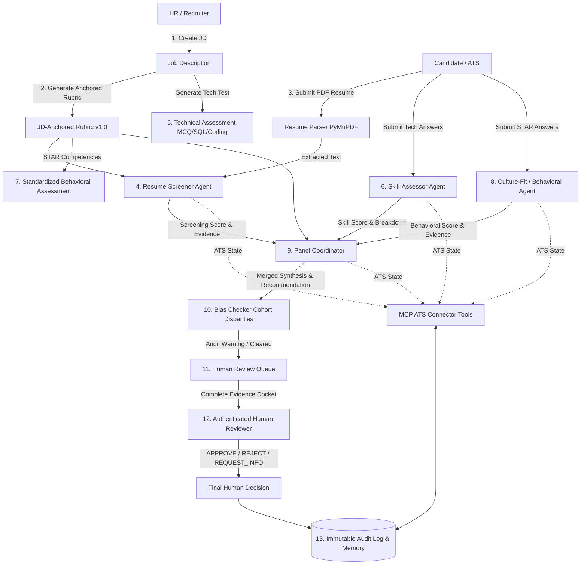

# Job Applicant Screening & Interview Panel Agent (JASIPA)

**JASIPA** is an HR-side agentic AI system for candidate evaluation that adheres strictly to human-in-the-loop governance:

> **Critical Governance Rule:**  
> **The AI must NEVER autonomously reject or hire a candidate.**  
> AI agents score candidates, identify strengths/gaps, synthesize recommendations, and flag statistical bias, but the final hiring decision is always signed by an authenticated human reviewer.

---

## 1. System Architecture



---

## 2. Specialized Multi-Agent Separation

1. **Resume-Screener Agent (`resume_screener.py`)**:
   - *Question:* "What does the candidate's resume/background indicate?"
   - Evaluates matched vs missing JD skills, years of experience, education, and projects against the anchored rubric.
   - Outputs structured evidence citations and fit score (0–100).

2. **Skill-Assessor Agent (`skill_assessor.py`)**:
   - *Question:* "What technical ability did the candidate demonstrate in an assessment?"
   - Evaluates submitted answers to practical technical questions (MCQ, SQL syntax, and graph cycle detection with algorithmic complexity).
   - Does NOT re-read the resume; measures demonstrated competence.

3. **Culture-Fit / Behavioral Agent (`culture_fit.py`)**:
   - *Question:* "How did the candidate handle past workplace situations using the STAR method?"
   - Evaluates responses to standardized behavioral questions (Communication, Team Collaboration, Problem Solving, Adaptability).
   - Never infers soft skills from resumes; rejects demographic bias; returns `INSUFFICIENT_EVIDENCE` for brief/evasive answers.

4. **Panel Coordinator Agent (`panel_coordinator.py`)**:
   - Merges the three independent agent perspectives according to rubric weights (40% Resume + 40% Technical + 20% Behavioral).
   - Identifies candidate strengths, gaps, and perspective divergences (e.g. resume buzzwords vs test score mismatch).
   - Recommendation values: `PROCEED_TO_HUMAN_REVIEW`, `HUMAN_REVIEW_REQUIRED`, `ADDITIONAL_INFORMATION_REQUIRED` (Never `AUTO_REJECT`).

5. **Bias Checker Agent (`bias_checker.py`)**:
   - Evaluates candidate outcomes against historical cohort statistics using the 4/5ths (80%) disparate impact standard.
   - Generates audit warning banners for the Human Reviewer without altering or auto-rejecting candidate data.

---

## 3. Model Context Protocol (MCP) ATS Tools

Agents access and mutate candidate pipeline records through standard MCP ATS tools:
* `get_candidate(candidate_id)`
* `get_job_description(jd_id)`
* `get_candidate_pipeline_status(candidate_id)`
* `save_screening_result(...)`
* `save_assessment_result(...)`
* `save_panel_decision(...)`
* `save_bias_check(...)`
* `save_human_review(...)`
* `get_candidate_history(candidate_id)`

---

## 4. Local Quickstart

### Prerequisites
* Python 3.10+
* Node.js 18+ (with npm)
* Docker & Docker Compose (optional for containerized deployment)

### 1. Backend Setup
```bash
cd backend
pip install -r requirements.txt
python scripts/seed_data.py
uvicorn app.main:app --reload --port 8000
```
API Documentation will be live at: [http://localhost:8000/docs](http://localhost:8000/docs)

### 2. Frontend Setup
```bash
cd frontend
npm install
npm run dev
```
Recruiter Portal will be live at: [http://localhost:5173](http://localhost:5173)

---

## 5. Docker Deployment

To launch PostgreSQL, FastAPI Backend, and React Frontend in Docker containers:
```bash
docker-compose up --build
```
* Frontend: [http://localhost:5173](http://localhost:5173)
* Backend API: [http://localhost:8000](http://localhost:8000)
* PostgreSQL: `localhost:5432`

---

## 6. Running Tests

Run the full pytest suite for agents, governance rules, and MCP tools:
```bash
cd backend
python -m pytest tests/
```

---

## 7. Demo Walkthrough Scenario (Steps 1 to 13)

1. **Step 1:** Recruiter creates "Senior Full Stack Engineer" Job Description.
2. **Step 2:** System generates versioned JD-anchored Rubric v1.0.
3. **Step 3:** Candidate uploads PDF resume; PyMuPDF extracts text and metadata.
4. **Step 4:** Resume-Screener Agent evaluates resume fit and evidence citations.
5. **Step 5:** Candidate completes technical assessment in the Assessment Room.
6. **Step 6:** Skill-Assessor Agent scores demonstrated technical answers.
7. **Step 7:** Candidate completes standardized behavioral STAR questions.
8. **Step 8:** Culture-Fit Agent evaluates behavioral competencies.
9. **Step 9:** Panel Coordinator merges all 3 scores and formulates recommendation.
10. **Step 10:** Bias Checker checks cohort parity and logs warning/cleared report.
11. **Step 11:** Human Reviewer inspects complete evidence dossier.
12. **Step 12:** Human Reviewer signs off with `APPROVE` / `REJECT` / `REQUEST_MORE_INFORMATION` with notes.
13. **Step 13:** System logs complete immutable audit trail.
